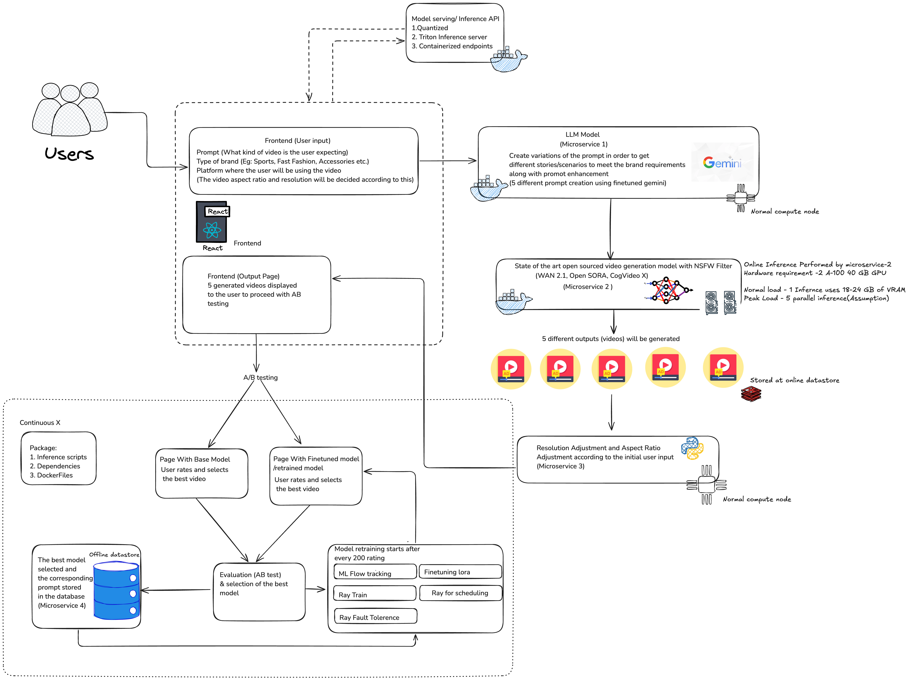

## AdFame

<!-- 
Discuss: Value proposition: Your will propose a machine learning system that can be 
used in an existing business or service. (You should not propose a system in which 
a new business or service would be developed around the machine learning system.) 
Describe the value proposition for the machine learning system. What's the (non-ML) 
status quo used in the business or service? What business metric are you going to be 
judged on? (Note that the "service" does not have to be for general users; you can 
propose a system for a science problem, for example.)
-->

### Contributors

<!-- Table of contributors and their roles. 
First row: define responsibilities that are shared by the team. 
Then, each row after that is: name of contributor, their role, and in the third column, 
you will link to their contributions. If your project involves multiple repos, you will 
link to their contributions in all repos here. -->

| Name                            | Responsible for | Link to their commits in this repo |
|---------------------------------|-----------------|------------------------------------|
| Yashdeep Prasad                 |Model serving and monitoring platforms                 |https://github.com/Bhumika-Shetty/AdFame/activity?actor=prasad-yashdeep                                    |
| Bhumika Dinesh Shetty           |Model training and training platforms               | https://github.com/Bhumika-Shetty/AdFame/activity?actor=Bhumika-Shetty                                   |
| Divij Kapur                     |Continuous X                |https://github.com/Bhumika-Shetty/AdFame/activity?actor=dk-4999                                    |
| Yashas Harisha                  |Data pipeline                 | https://github.com/Bhumika-Shetty/AdFame/activity?actor=yashas-h                                   |


### System diagram



** Note- All the microservices are containerised using docker and the orchestration takes place using kubernetes.
Currently we are experimenting multiple text to Video generation models , namely - Wan2.1, Hunyuan video, Open-sora, Cogxvideo


<!-- Overall digram of system. Doesn't need polish, does need to show all the pieces. 
Must include: all the hardware, all the containers/software platforms, all the models, 
all the data. -->

### Summary of outside materials

<!-- In a table, a row for each dataset, foundation model. 
Name of data/model, conditions under which it was created (ideally with links/references), 
conditions under which it may be used. -->

| Dataset       | How it was created                                                                 | Conditions of use                                                                 |
|---------------|------------------------------------------------------------------------------------|-----------------------------------------------------------------------------------|
| **VidProM**   | Created by Wenhao Wang et al. from public web sources, focusing on video prompts for generative tasks. | The prompts and videos generated by Pika in our VidProM are licensed under the CC BY-NC 4.0 license. Additionally, similar to their original repositories, the videos from VideoCraft2, Text2Video-Zero, and ModelScope are released under the Apache license, the CreativeML Open RAIL-M license, and the CC BY-NC 4.0 license, respectively. Our code is released under the CC BY-NC 4.0 license. |
| **OpenVid-1M** | Created by Nan et al. by aggregating 1M+ text-video pairs from public datasets (e.g., Panda, ChronoMagic), with captions and 1080p videos. | CC-BY-4.0 license; requires attribution. Check source dataset licenses (e.g., CelebvHQ) for commercial use. Cite the dataset in publications. |
| **AdImageNet** | The data is derived from a comprehensive collection of programmatic creative images hosted by Project300x250.com. The creative text was extracted from each image using Google's Vision API.|  |
| Base model 1 | Wan2.1 is designed on the mainstream diffusion transformer paradigm, achieving significant advancements in generative capabilities through a series of innovations. These include our novel spatio-temporal variational autoencoder (VAE), scalable training strategies, large-scale data construction, and automated evaluation metrics. Collectively, these contributions enhance the model’s performance and versatility.                   | The models in this repository are licensed under the Apache 2.0 License. We claim no rights over the your generated contents, granting you the freedom to use them while ensuring that your usage complies with the provisions of this license. You are fully accountable for your use of the models, which must not involve sharing any content that violates applicable laws, causes harm to individuals or groups, disseminates personal information intended for harm, spreads misinformation, or targets vulnerable populations. For a complete list of restrictions and details regarding your rights, please refer to the full text of the license.| 

### Summary of infrastructure requirements

<!-- Itemize all your anticipated requirements: What (`m1.medium` VM, `gpu_mi100`), 
how much/when, justification. Include compute, floating IPs, persistent storage. 
The table below shows an example, it is not a recommendation. -->

| Requirement     | How many/when                                     | Justification |
|-----------------|---------------------------------------------------|---------------|
| `m1.medium` VMs | 3 for entire project duration                     | Used across three environments: "dev/staging," "canary," and "production," each operating independent CI/CD pipelines and serving models separately.         |
| `gpu_mi100`     | 4 hour block thrice a week                         |     Fine-tuning different models for text to image/video generation using 4×A100 GPUs.(Minimum VRAM 80GB or higher)          |
| Floating IPs    | 3 for entire project duration, 1 for sporadic use |     Each m1.medium environment instance is assigned one IP, with an additional IP allocated for occasional GPU usage.          |
| Persistent Storage             |             1 TB                                      |     Stores large volumes of images, videos, and model versions generated by text-to-image/video workflows.          |

### Detailed design plan

<!-- In each section, you should describe (1) your strategy, (2) the relevant parts of the 
diagram, (3) justification for your strategy, (4) relate back to lecture material, 
(5) include specific numbers. -->

#### Model training and training platforms

<!-- Make sure to clarify how you will satisfy the Unit 4 and Unit 5 requirements, 
and which optional "difficulty" points you are attempting. -->

# 🧠 Brand-Focused Video Diffusion Training System

> Scalable Training, Retraining, and Optimization Pipeline for Domain-Specific Text-to-Video Generation  
> **Unit 4 & Unit 5 Compliant**

---

## 📌 Project Overview

We fine-tune state-of-the-art open-source text-to-video models such as:

- **Wan 2.1** (T2V-1.3B & 14B)
- **Open-SORA**
- **CogVideoX**

Our focus: tailor these models to brand-specific marketing domains using curated video+prompt datasets.

---

## 🔁 Training and Retraining Strategy (Unit 4)

### ✅ Initial Fine-Tuning
- Brand-focused video dataset (e.g., sportswear commercials)
- Image + video support using the `finetrainers` library

### 🔁 Retraining via A/B Preference Loop
1. User enters a prompt
2. System generates 5 candidate videos
3. User selects the best one
4. Prompt + selected video stored in feedback DB
5. After every 200 selections → **automatic retraining**

> 🔄 Continuous learning loop to evolve with user preference


---

## 🎯 Modeling & Model Selection (Unit 4)

### 🔍 Selection Criteria
- High-quality, coherent video generation
- Open-source accessibility & fine-tune readiness

| **Model**              | **Task**       | **LoRA VRAM** | **Full FT VRAM** |
|------------------------|----------------|----------------|------------------|
| Wan 2.1 (1.3B)         | Text-to-Video  | ~12 GB         | ~24–30 GB        |
| Wan 2.1 (14B)          | Text-to-Video  | ~30 GB         | ~125+ GB         |
| Open-SORA (11B)        | Text-to-Video  | ~28 GB         | ~110 GB          |
| CogVideoX (5B)         | Text-to-Video  | 18–47 GB       | 53–80 GB         |

---

## 🧪 Fine-Tuning Approach

### 🚀 Efficiency Techniques
- ✅ **LoRA** (Low-Rank Adaptation)
- ✅ Gradient Accumulation
- ✅ Layer Freezing
- ✅ Mixed Precision (fp16 / bf16)
- ✅ Experimental FP8 support


### ⚙️ Training Library: `finetrainers`
- ✅ DDP, FSDP-2, HSDP support
- ✅ Combined image/video datasets
- ✅ Precomputation + async streaming
- ✅ Support for FP8 / future QAT

---

## 🗂 Domain-Specific Dataset

Curated for each brand:
- 📹 Commercial ads
- 📱 Social media videos
- 🖼 Product stills
- ✍️ Prompt-formatted ad copy

### Dynamic Expansion:
- Add prompt–video pairs chosen by users in feedback loop
- Align training with high-engagement content

---

## 🧠 Justification

- Adaptable to various brand styles & aesthetics
- Avoids overfitting via LoRA & layer freezing
- Handles complex prompts (e.g., “logo graffiti on wall”)
- Maintains brand visual consistency
- Supports evolving user tastes via retraining

---

## ⚙️ Infrastructure & Experimentation (Unit 5)

### ☁️ Training Infrastructure
- 🧩 Ray Cluster for distributed job scheduling
- 🧪 MLflow hosted on Chameleon (self-hosted tracker)
- 🐳 Dockerized training pipeline for portability


---

## 🧪 Experiment Tracking

| Tool     | Usage                  |
|----------|------------------------|
| MLflow   | Track losses, models, metrics, outputs |
| MinIO    | Store model artifacts  |
| GitHub   | Version control + README |

---

## 🚦 Advanced Strategies (Extra Difficulty Points)

### 🛡️ Fault-Tolerant Training (Ray Train)
- Auto-restart from last checkpoint
- Resilient to spot instance preemption

### 🎛️ Hyperparameter Tuning (Ray Tune)
- Search: learning rate, LoRA rank, batch size
- Algorithms: ASHA, PBT, Bayesian Optimization

### 📊 Performance Scaling
- Compare DDP vs FSDP
- Plot training time vs # of GPUs
- Estimate speedup & memory savings


## 🧭 Acknowledgments

- [Wan 2.1](https://github.com/wan-developers)
- [Open-SORA](https://github.com/hpcaitech/Open-Sora)
- [CogVideoX](https://huggingface.co/THUDM/CogVideoX-5b)
- [finetrainers](https://github.com/a-r-r-o-w/finetrainers)


#### Model serving and monitoring platforms
# 🎥 Fine-Tuned Video Diffusion Model Serving

This project provides a **RESTful API** using **FastAPI** to generate videos from textual prompts via a fine-tuned **video diffusion model** (up to 14B parameters). Designed for automated marketing content creation, the service meets strict performance and reliability targets with advanced model and system-level optimizations.


## 🚀 API Endpoint

**POST** `/generate-video`  
Accepts a text prompt and returns a generated video.

### 🔧 Example Request
```json
{
  "prompt": "A sunset over the ocean in the style of a watercolor painting",
  "num_frames": 16,
  "fps": 8
}
```

### 📼 Example Response
```json
{
  "video_url": "https://example.com/videos/gen_abc123.mp4",
  "frames": 16,
  "fps": 8,
  "duration": 2.0
}
```

---

## 🎯 Performance Requirements

- **Max Model Size**: 14B parameters  
- **Batch Throughput**: 4 prompts / 2 minutes  
- **Single Prompt Latency**: < 30 seconds  
- **Concurrent Users**: 5–10 (cloud-based)  

---

## 🧠 Model-Level Optimizations

- ✅ **Mixed-Precision Inference** (FP16/BF16)
- ✅ **INT8 Static Quantization** (ONNX)
- ✅ **ONNX Graph Optimizations**: Constant folding, operator fusion
- ✅ **Optimized Attention**: FlashAttention, xFormers

### 🧩 Distributed Inference Strategies

<details>
<summary><strong>Ulysses Strategy</strong></summary>

- Use `--ulysses_size $GPU_NUMS`
- Heads must be divisible by number of GPUs
- Not suitable for 1.3B model with 12 heads on 8-GPU setup

</details>

<details>
<summary><strong>Ring Strategy</strong></summary>

- Use `--ring_size $GPU_NUMS`
- Sequence length must be divisible by ring size
- More flexible than Ulysses

</details>

<details>
<summary><strong>Hybrid Strategy</strong></summary>

- Combine Ulysses and Ring
- Example: Ulysses intra-node, Ring inter-node

</details>

### 📈 TeaCache Acceleration
- Reduces redundant computations during diffusion steps  
- Achieves up to **2× speedup**

---

## 🧰 System-Level Optimizations

- 🔄 **Asynchronous FastAPI handlers**
- 📬 **Redis-backed job queue** (manages concurrent jobs)
- 🔁 **Model warm pools** (avoids cold starts)
- ⚡ **Load balancing** with autoscaling (Kubernetes compatible)

---

## 📦 Deployment Options

| Platform           | Latency       | Throughput           | Cost             |
|-------------------|---------------|-----------------------|------------------|
| **GPU Server**     | ~20–30 sec    | 4+ videos / 2 minutes | High performance |
| **CPU (ONNX)**     | ~180+ sec      | 1–2 videos / 5 minutes| Budget-friendly  |
| **Edge Device**    | 5–10+ minutes  | 1 video / 5–10 minutes | Low cost         |


# 🛠️ Online Evaluation, Feedback Loop, and Monitoring


## 📊 Evaluation & Monitoring

### 📍 Offline Evaluation (via MLflow)

- **Text-Video Alignment**: CLIP score  
- **Realism**: Fréchet Video Distance (FVD)  
- **Temporal Consistency**: Frame similarity  
- **Fairness Testing**: Diverse demographic prompts  
- **Known Failure Modes**: Flickering, object drift  
- **Unit Tests**: Ensure API validity

### 🧪 Load Testing in Staging

- Simulates real user traffic (5–10 concurrent prompts)  
- Tests varying prompt lengths, GPU load, etc.


## 🧪 Canary Deployment Strategy

We implement a **canary deployment** approach to safely roll out new model versions:

- **Initial Split**: Deploy the new model alongside the old one. Only ~5% of real or artificial user traffic is routed to the new version.
- **Simulated Users**: We simulate a diverse range of user prompts to reflect real-world behavior. These include:
  - Short, generic prompts (e.g., "a city skyline")
  - Domain-specific prompts (e.g., branded content like "Nike shoes on a basketball court")
  - Long descriptive prompts
  - Edge-case and fairness-related prompts (e.g., diverse demographic references)

### 🔍 Monitoring During Canary Phase

- Log **generation latency**, **errors**, and **CLIP-based similarity scores**.
- Sample generated outputs for **manual inspection**.
- Compare canary metrics vs. baseline to evaluate improvements or regressions.

### 🔁 Promotion or Rollback

- If performance is stable, gradually increase canary traffic to 25%, 50%, then 100%.
- Roll back instantly to the old model if:
  - Latency spikes
  - Output quality drops
  - User complaints increase

## 🔄 Close the Feedback Loop

To continuously improve our model post-deployment:

- **User Feedback**
  - Collect ratings or regenerate signals from users
  - Log interaction metrics (e.g., time spent, downloads, shares)
- **Annotation & Ground Truth**
  - Manually review a sample of production outputs
  - Use human annotation or automated checks (e.g., brand compliance)
- **Production Data Storage**
  - Save a portion of prompt-output pairs
  - Label and use this data for periodic fine-tuning

## 📈 Business-Specific Evaluation Plan

While not fully deployed in production, we define a plan for future business-aligned evaluations:

- **Brand Compliance**: Ensure outputs align with visual identity standards (logo, colors, tone)
- **Engagement Metrics**: Monitor share/download rates as proxy for content effectiveness
- **Speed to First Frame**: Measure how quickly content can be generated and published

## 🧠 Extra Difficulty Points Attempted

### 📊 Monitor for Data & Label Drift

- Use text embeddings to monitor **prompt distribution shift**
- Detect visual drift in output content (e.g., style shifts)
- Visualize prompt clusters over time in a dashboard

### 🔧 Monitor for Model Degradation

- Track trends in CLIP scores, latency, and user behavior
- Alert engineers when thresholds are crossed
- Automatically trigger retraining with fresh labeled production data

## 🔁 Automated Recovery & Continuous Learning

We implement a **self-healing pipeline**:

1. Monitor: Log and evaluate metrics in real-time
2. Detect: Spot drift or degradation
3. Retrain: Use recent data to fine-tune model
4. Validate: Run updated model through eval pipeline
5. Deploy: Use canary rollout for safe promotion

---

> This framework ensures that the deployed video diffusion model remains accurate, fair, and aligned with user expectations—even as inputs, content demands, and business goals evolve.


#### Data pipeline

<!-- Make sure to clarify how you will satisfy the Unit 8 requirements,  and which 
optional "difficulty" points you are attempting. -->
This data pipeline supports a prompt-to-video model, handling data ingestion, processing, and storage for training, inference, retraining. The primary datasets are VidProM (1M+ records), AdImageNet, and OpenVid-1M (1M+ records) for training. Each prompt is modified into 5 variations, generating 5 videos for A/B testing, with the best video stored for retraining. 

- **Persistent Storage**: A detachable Chameleon volume will be provisioned using OpenStack Cinder to store all non-Git-tracked artifacts, including raw and processed datasets (VidProM, AdImageNet, OpenVid-1M), training artifacts (e.g., preprocessed video frames), generated videos, A/B testing results, benchmarking data, PostgreSQL’s data directory, Kafka’s logs, and Spark’s temporary files. The volume will be mounted to the Chameleon instance (e.g., a medium instance with 4 CPUs, 8 GB RAM) and detached when not in use, ensuring data durability across instance restarts.

- **Offline Data**: VidProM, AdImageNet, and OpenVid-1M metadata (e.g., prompts, video IDs, image labels) will be stored in PostgreSQL tables. Videos/images will reside in directories on the persistent volume, serving as the “Offline Datastore”.

- **Data Pipelines**: The ETL pipeline will use PySpark to process data at scale, leveraging Spark’s distributed computing for 2M+ records. PySpark will extract data from VidProM, AdImageNet, and OpenVid-1M on Hugging Face, downloading files with huggingface_hub and reassembling OpenVid-1M parts. Transformations will be performed in parallel: videos resized to 720p and images to 224x224 using opencv (called via PySpark UDFs), metadata normalized (e.g., lowercase prompts, standardize formats), and duplicates filtered. Processed metadata will be loaded into PostgreSQL via JDBC, and videos/images saved to the persistent volume. The pipeline will log best videos from A/B testing in best_videos for retraining every 200 ratings

- **Online Data**: A streaming pipeline will use Kafka to ingest simulated prompts, creating 5 variations per prompt in a Kafka topic (prompts). Kafka (running on a Chameleon instance) will queue prompts for video generation, ensuring reliable delivery with a producer (kafka-python). A consumer will process results, logging prompts, videos, and A/B testing data to PostgreSQL via JDBC in tables. This setup simulates production use, meeting Unit 8’s requirement for real-time data handling.

- **Interactive Data Dashboard**: A Streamlit dashboard will be hosted on Chameleon, providing team visibility into data and performance. It will display offline stats (e.g., dataset sizes, quality metrics like % of corrupted files, precomputed by PySpark and stored in dashboard_stats), online metrics (e.g., prompt arrival rates, video generation counts, A/B testing trends), and benchmarking results (e.g., quality scores vs. OpenVid-1M’s 1080p subset).


#### Continuous X

<!-- Make sure to clarify how you will satisfy the Unit 3 requirements,  and which 
optional "difficulty" points you are attempting. -->

Continuous X: Cloud-Native CI/CD and Continuous Training for Video Generation and AB Testing

Objective

Design a cloud-native CI/CD pipeline with staged deployment, infrastructure-as-code (IaC), and automated continuous training to support the video generation and AB testing system.

1. Infrastructure-as-Code (IaC) & Cloud-Native Design

Tools:

Terraform: Declaratively define Chameleon infrastructure (VMs, networks, storage) in Git. (made the Terraform Files and shell scripts to mount data but that did not work so you setup a VM on Jupyter Notebook. Reference: "terraform/kvm" folder and "1-create-server-data-pipeline.ipynb" notebook in "Resource Setup".)

Ansible: Automate software installation (Docker, Ray, MLFlow) and configuration on provisioned VMs. (You setup Ansible with refrence to "Ansible" folder.)

ArgoCD/Helm: Manage Kubernetes deployments for microservices (LLM, video generation, resolution adjustment). ("ArgoCD" setup present in "argocd" subfolder in "Ansible" folder.)

2. CI/CD Pipeline Design

Trigger: Code push to the main branch or manual trigger.

Stages:

Build & Test:

Containerize each scripts using Docker.

Continuous Training:

Ray Cluster Integration: Submit model retraining jobs (e.g., finetuned attention model) to Ray via Argo Workflows.

Experiment Tracking: Log metrics to MLFlow.

Staging Deployment:

Deploy to staging using ArgoCD. Mirror production but with fewer replicas.

Trigger canary deploy when staging tests pass and so on for Prod.

Canary Deployment:

Monitor canary deployment. If successful, promote to production.

Production Deployment:

Full rollout after canary success. Use Kubernetes autoscaling for high traffic.

3. Staged Environments(Intended but could not implement fully)

For "Canary", "Staging" and "Production" environment you will attach a screenshot showing Argo dashboard i.e "Argo Dashboard for different env" image file.

Testing: Unit and integration tests with simulated loads.

Staging: Low-resource setup for integration testing and canary testing.

Canary: Partial rollout to detect regressions and anomalies.

Production: Scalable deployment with GPU nodes and full workload capacity.

4. Continuous Training Integration

Triggers:

Scheduled retraining based on model performance.(Intended but could not finish feedback loop)

Data Pipeline:

Unit 8’s ETL processes ingest new user feedback and production data for retraining. (Ref: docker-compose-online-data.yaml)


# 🎥 AdFame Project Presentation (MLOps Final)

## ✅ Unit 1: Value Proposition & Scale

### 🎯 Value Proposition
**Customer:**  
A *creative marketing lead at Nike or Adidas* who wants to generate high-quality branded video ads rapidly, without relying on expensive production cycles.

**Value Proposition:**  
We deliver a system that can take natural language prompts (e.g., “A woman running in Nike shoes on a beach”) and generate short, visually engaging, brand-aligned video ads. This helps marketers iterate quickly on creative concepts.

**Design Influences:**  
- **Data**: Large-scale curated fashion-specific video-text dataset
- **Deployment**: Cloud-native, GPU-backed inference endpoints
- **Evaluation**: Business-aligned metrics (e.g., visual fidelity, brand tone), offline loss, and latency

### 📈 Scale
- **Data Size**: 20 GB (object store) + 200 GB (block storage during processing)
- **Model**: Wan 2.1 (14B parameters), fine-tuned using LoRA
- **Training Time**: 5 epochs ~ 45 minutes (A100 GPU)
- **Inference Load**: ~500 requests/day (~20/hour)

---

## ☁️ Unit 2/3: Continuous X (Infra + CI/CD)

### 🖼️ Cloud-Native Architecture
> *(Updated system diagram here)*

- Training: Ray, MLflow, Docker Compose
- Serving: FastAPI + Uvicorn + TorchScript
- Data: MinIO (object store) + Block Storage (video extraction)
- CI/CD: GitHub Actions + Docker Registry

### 🛠️ Infrastructure as Code
Repo: [`/docker`](https://github.com/Bhumika-Shetty/AdFame/tree/main/docker)  
Provision via:
```bash
docker compose -f docker-compose-training-data.yaml up --build -d

```

## 🗃️ Unit 8: Data Person

### 1. 📦 Persistent Storage

We use two forms of persistent storage on Chameleon Cloud:

#### 🪣 Object Store: `AdFame-project-group15`

- **Contents**:
  - Train, Evaluation, Production datasets
  - Inference results: videos and prompts
- **Size**: ~20 GB
- **Used By**: Model training pipeline and inference server

#### 💽 Block Storage: `block-persist-project15`

- **Attached to**: VM instance
- **Size**: ≥200 GB
- **Used For**:
  - Downloading raw zip files (159 zip files ~40GB each)
  - Extracting video/prompt samples
  - Temporary staging for metadata, mapping files, and filtered outputs
- **Notes**:
  - Zip files are deleted after video extraction to save space

📖 **Instructions**: [Data Pipeline Setup Guide](https://github.com/Bhumika-Shetty/AdFame/tree/main/Data%20pipeline%20notebooks)

---

### 2. 🧾 Offline Data

#### 📚 Dataset: [OpenVid-1M](https://huggingface.co/datasets/nkp37/OpenVid-1M)

**Source**:
- Aggregates video-text pairs from online repositories, human-labeled datasets, and prior generative systems.

**Each Sample Includes**:
- A **text prompt** (e.g., "A woman jogging in Adidas sportswear")
- A **short video clip** (real/synthetic)
- **Metadata**: tags, duration, resolution (optional)

**Data Lineage**:
- Prompt + video pairs from OpenVid-1M
- Curated by filtering fashion-specific contexts (e.g., "Nike shoes", "basketball court", "urban streetwear")

**Example Sample**:

| Field       | Value                                            |
|-------------|--------------------------------------------------|
| Prompt      | "A teenager skateboarding in Nike sneakers"      |
| Video       | `/zip_archive/video_08732.mp4`                   |
| Tags        | `nike, skateboarding, urban, sportswear`         |
| Duration    | 5.2 seconds                                      |
| Resolution  | 480x640                                          |

This sample relates to **Nike's marketing needs**: youth appeal, athletic motion, and brand visibility.

**Production Sample Lifecycle**:
- Same format as training
- Prompts arrive from live user input or batch curation
- Videos generated
- Optionally rated and reused as feedback for retraining (active learning)

Mapping Reference:  
- [OpenVid-1M-mapping](https://huggingface.co/datasets/phil329/OpenVid-1M-mapping)

---

### 3. 🔄 Data Pipeline

📁 YAML Config: [`docker-compose-training-data.yaml`](https://github.com/Bhumika-Shetty/AdFame/blob/main/docker/docker-compose-training-data.yaml)

#### 🛠 Services Overview

**`extract-fashion-videos`**:
1. Download metadata + mappings and create a unified dataframe.
2. Filter prompts by:
   - Brand keywords (`nike`, `adidas`, etc.)
   - Minimum video duration
   - Quality scores
3. Map prompts to zip file locations
4. Download only required zip files using **3 threads**
5. Extract relevant videos + prompts
6. Store outputs in **block storage** and delete zip files

**`split-fashion-data`**:
- Split into:
  - **Train**: 70%
  - **Evaluation**: 15%
  - **Production**: 15%
- Prevents overlap and leakage between evaluation and training sets

**`load-data`**:
- Upload split datasets from block storage into the **MinIO object store**

---

### 4. 📊 (Optional) Data Dashboard

> *Planned feature*

A future dashboard could visualize:
- Category distribution (e.g., sportswear vs casual)
- Tag frequency heatmaps
- Zip archive coverage
- Quality filtering thresholds

**Customer Benefit**:  
Helps Nike/Adidas teams monitor dataset scope, refine prompt strategy, and evaluate curation coverage (e.g., "Do we have enough videos for basketball scenes?" or "Which styles are underrepresented?").

---


Here is the markdown version of the provided text:

---

# Continuous X: Cloud-Native CI/CD and Continuous Training for Video Generation and AB Testing

## Objective

Design a cloud-native CI/CD pipeline with staged deployment, infrastructure-as-code (IaC), and automated continuous training to support the video generation and AB testing system.

---

### 1. Infrastructure-as-Code (IaC) & Cloud-Native Design

**Tools:**

* **Terraform:** Declaratively define Chameleon infrastructure (VMs, networks, storage) in Git.

  * *Implementation:* Made the Terraform files and shell scripts to mount data, but they did not work. As a result, set up a VM on Jupyter Notebook.
  * *Reference:* `terraform/kvm` folder and `1-create-server-data-pipeline.ipynb` notebook in "Resource Setup".

* **Ansible:** Automate software installation (Docker, Ray, MLFlow) and configuration on provisioned VMs.

  * *Implementation:* Set up Ansible.
  * *Reference:* `Ansible` folder.

* **ArgoCD/Helm:** Manage Kubernetes deployments for microservices (LLM, video generation, resolution adjustment).

  * *Implementation:* ArgoCD setup is present in the `argocd` subfolder within the `Ansible` folder.

---

### 2. CI/CD Pipeline Design

**Trigger:** Code push to the main branch or manual trigger.

#### Stages:

1. **Build & Test:**

   * Containerize each script using Docker.

2. **Continuous Training:**

   * **Ray Cluster Integration:** Submit model retraining jobs (e.g., finetuned attention model) to Ray via Argo Workflows.
   * **Experiment Tracking:** Log metrics to MLFlow.

3. **Staging Deployment:**

   * Deploy to staging using ArgoCD.
   * Mirror production but with fewer replicas.
   * Trigger canary deployment when staging tests pass and so on for production.

4. **Canary Deployment:**

   * Monitor canary deployment.
   * If successful, promote to production.

5. **Production Deployment:**

   * Full rollout after canary success.
   * Use Kubernetes autoscaling for high traffic.

---

### 3. Staged Environments (Intended but could not implement fully)

For "Canary", "Staging", and "Production" environments, see the attached screenshot showing the Argo dashboard:

* *File:* `Argo Dashboard for different env` (image file).

#### Environment Breakdown:

* **Testing:** Unit and integration tests with simulated loads.
* **Staging:** Low-resource setup for integration testing and canary testing.
* **Canary:** Partial rollout to detect regressions and anomalies.
* **Production:** Scalable deployment with GPU nodes and full workload capacity.

---

### 4. Continuous Training Integration

**Triggers:**

* Scheduled retraining based on model performance.

  * *Status:* Intended but could not complete the feedback loop.

**Data Pipeline:**

* Unit 8’s ETL processes ingest new user feedback and production data for retraining.

  * *Reference:* `docker-compose-online-data.yaml`

---

Let me know if you need any modifications or additional sections!

